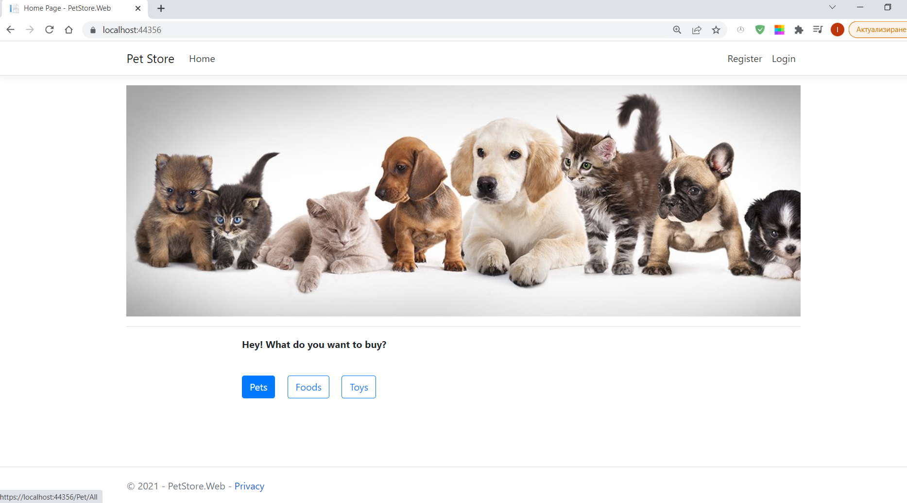
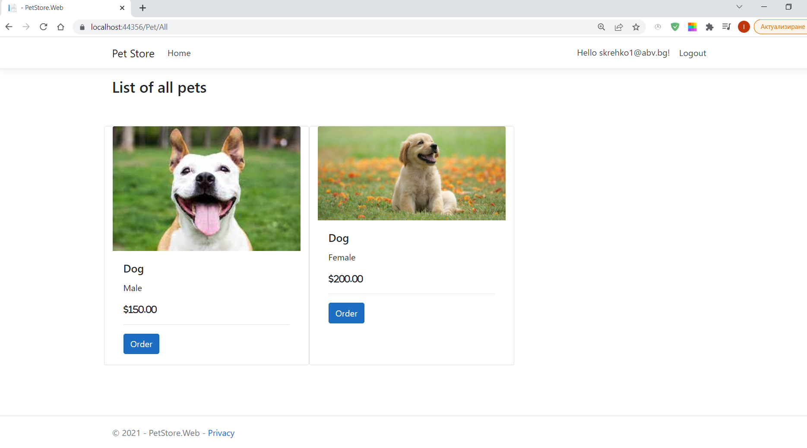
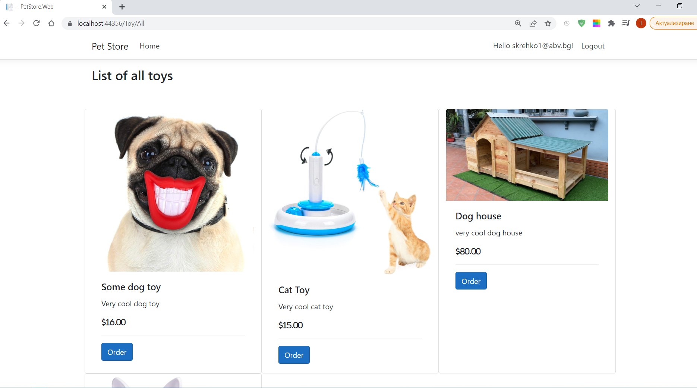
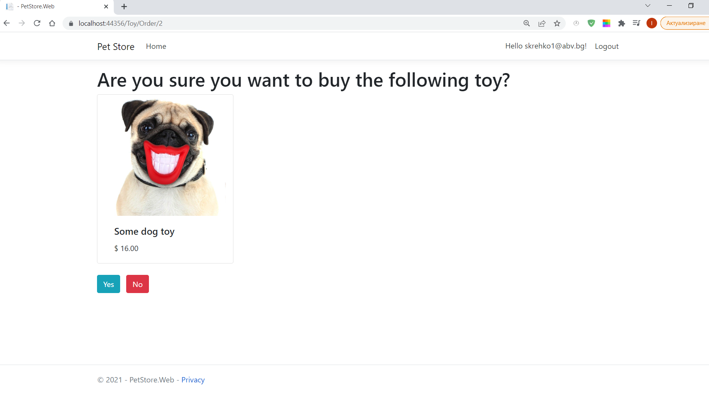
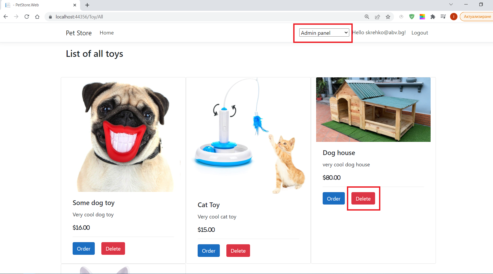
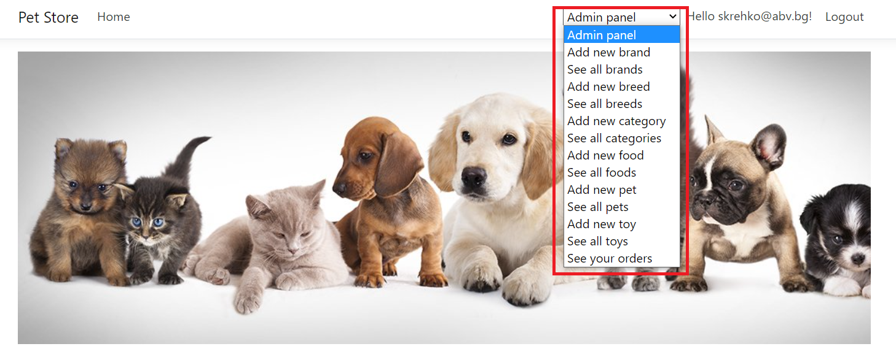

# Final Web-Project at SoftUni using ASP.NET Core

---

 Pet store is a simple web shop where you can buy food, toys or even a pet. The admin can delete food, toys and pets, and can confirm orders.

---
**View of Home Page**

**View of Pets Page**

**View of Toys Page**

**You can order a product**

**View of admin menu**

---
**Build with**:

* *ASP.NET Core*
* *EF Core*

---

Microsoft SQL Server along with Entity Framework Core were used to create and store the values. The database schema consists of the following main entities:

 * Brand
 * Breed
 * Category
 * Food
 * Order 
 * Pet
 * StoreUser
 * Toy

---

**Future work**

* *Add unit tests*

This website has been created solely for educational purposes.